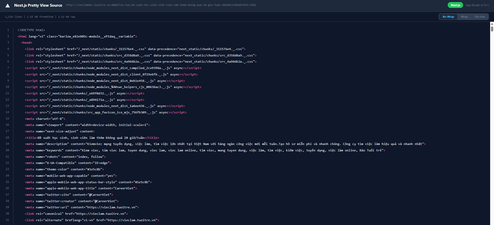

# Next.js Pretty View Source

Browser extension (Manifest V3) that opens a **pretty view source** for Next.js pages in a full tab with syntax highlighting.

## Preview

## What it does

- Detects Next.js sites (Pages Router via `__NEXT_DATA__`, App Router via flight/streaming signals, `_next` assets, and related markers).
- Surfaces router type and serialized Next data when available so you can inspect what the app shipped to the client.

## Install (developer / unpacked)

1. Clone this repo.
2. Open Chrome (or another Chromium browser) → **Extensions** → enable **Developer mode**.
3. **Load unpacked** and choose the folder that contains `manifest.json`.

## Usage

Click the extension action on a Next.js page to open the viewer (see `viewer.html` / `viewer.js`).

## Permissions

The extension requests `activeTab`, `scripting`, `tabs`, `storage`, and broad host access so it can run on pages you visit and open the viewer tab. Review `manifest.json` before installing.

## Version

Current extension version: **1.5.1** (see `manifest.json`).
